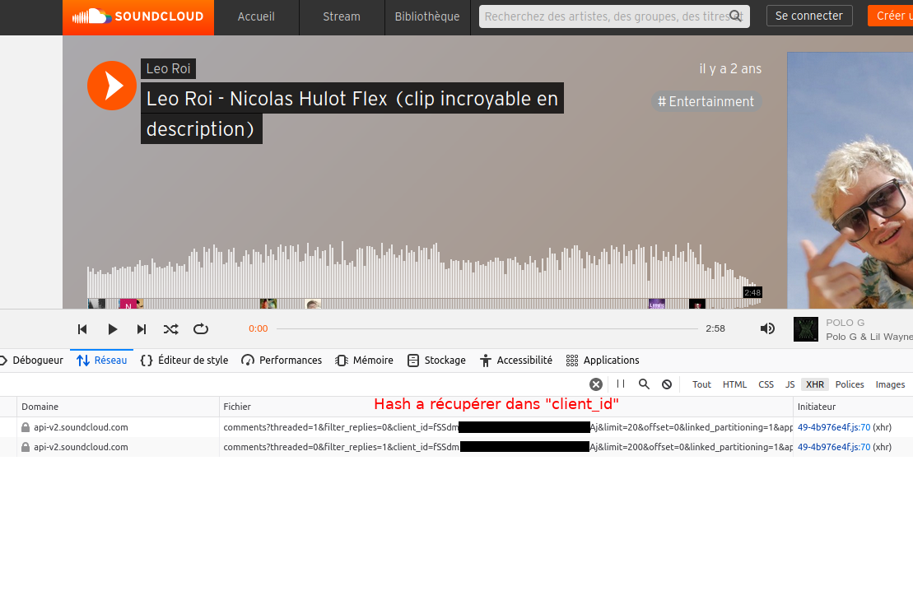
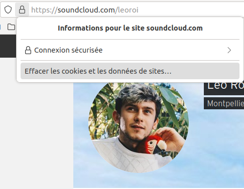
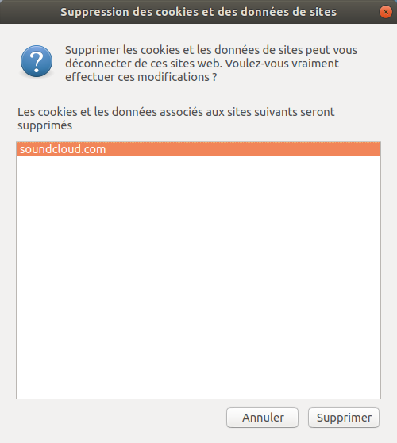

# Debussy - Collect on Soundcloud

## Description & fonctionnalités

Debussy est un outil d'OSINT permettant notamment de récupérer les commentaires donné aux musiques d'un profile sur soundcloud.
_C'est aussi un compositeur français du 19ème siècle ;)_

Il possède quatre options pour cela :
 - biggest-com qui liste les profiles des gens par ordre de fréquence, la personne ayant commenté la première se retrouvant donc en premier
 - list-com qui liste l'intégralité des commentaires
 - cloudword qui liste les mots employés dans les commentaires par ordre d'importance
 - export qui permet d'exporter les données au format CSV ou JSON

**Il nécessite un token que l'on peut récupérer en une manipulation sur soundcloud.com**

 ## installation

 `pip3 install -r requirements.txt`

note : `spacy` est une dépendance permettant de faire la partie "nuage de mots" (cloudword). Si vous n'utilisez pas cette fonctionnalité, pas besoin d'utiliser spacy.
Pour utiliser spacy, il est aussi nécessaire de lancer la commande :
`python3 -m spacy download en`
qui va installer le lexique anglais de spacy.

## utilisation

Debussy propose une commande d'aide directe :

```bash
$ python3 main.py -h
Debussy par darcosion (https://github.com/darcosion)
usage: main.py [-h] [-u URL] [-t TOKEN] [-b] [-l] [-c] [-e EXPORT]

optional arguments:
  -h, --help            show this help message and exit
  -u URL, --url URL     user à investiguer
  -t TOKEN, --token TOKEN
                        client_id token
  -b, --biggest-com     personnes qui commentent le plus
  -l, --list-com        list de com
  -c, --cloudword       occurence de mots
  -e EXPORT, --export EXPORT
                        exporter en CSV ou en JSON dans un fichier
```

note : la fonction d'export regarde automatiquement l'extension de fichier donné, si elle vois un `-e fichier.json`, elle exportera en json et si elle voit un `-e fichier.csv`, elle exportera en csv.

Il s'utilise de la sorte :  


```bash
$ python3 main.py -u https://soundcloud.com/leoroi -t <id_client> -b
Debussy par darcosion (https://github.com/darcosion)
                                           Commentateurs par fréquence                                            
┏━━━━━━━━━━━━┳━━━━━━━━━━━━━━━━━━━━━━━━━━━━━━━━━━━━━━━━━━━━━┳━━━━━━━━━━━━━━━━━━━━━━━━━━━━━━━━━━━━━━━━━━━━━━━━━━━━━┓
┃ Occurences ┃ username                                    ┃ lien_profile                                        ┃
┡━━━━━━━━━━━━╇━━━━━━━━━━━━━━━━━━━━━━━━━━━━━━━━━━━━━━━━━━━━━╇━━━━━━━━━━━━━━━━━━━━━━━━━━━━━━━━━━━━━━━━━━━━━━━━━━━━━┩
│ 6          │ Capcomjazzentertainment                     │ https://soundcloud.com/capcomjazzent                │
│ 5          │ Ludwigvandub                                │ https://soundcloud.com/ludwigvandub                 │
│ 5          │ Yung Nodjok                                 │ https://soundcloud.com/yungnodjok                   │
│ 3          │ Tetsujin                                    │ https://soundcloud.com/txtsxjxn                     │
│ 3          │ Maître Hervé                                │ https://soundcloud.com/exeio                        │
│ 3          │ Claver-san                                  │ https://soundcloud.com/claver-san                   │
│ 3          │ Lucien Basdevant - Luken                    │ https://soundcloud.com/luuken                       │
│ 3          │ ☾louisebises☽                               │ https://soundcloud.com/louisebises                  │
│ 3          │ Fantasmonarch                               │ https://soundcloud.com/fantasmonarch                │
│ 3          │ Adel Faure                                  │ https://soundcloud.com/adelfaure                    │
│ 2          │ Tristecadavre666                            │ https://soundcloud.com/emonsoy666                   │
│ 2          │ xxz                                         │ https://soundcloud.com/xxxzxxxzxxxz                 │
│ 2          │ K0M4                                        │ https://soundcloud.com/user-705113193-565327199     │
│ 2          │ Roger Federêve                              │ https://soundcloud.com/fedecrepes                   │
│ 2          │ Flocon FTS                                  │ https://soundcloud.com/user449838177                │
│ 2          │ Cour de récré                               │ https://soundcloud.com/courderecre                  │
│ 2          │ iZaack Quiroga                              │ https://soundcloud.com/izaack-quiroga               │
│ 2          │ Younai Modzfr                               │ https://soundcloud.com/younai-modzfr                │
│ 2          │ Meo                                         │ https://soundcloud.com/meorciaa                     │
│ 2          │ ParanormalCraftFR                           │ https://soundcloud.com/paranormalcraftfr            │
│ 2          │ Kourm                                       │ https://soundcloud.com/kourmwave                    │
│ 2          │ Donckele                                    │ https://soundcloud.com/neirda-donckele              │
│ 2          │ gracchus nortug.                            │ https://soundcloud.com/gracchusnortug               │
│ 1          │ Le teckel prolo                             │ https://soundcloud.com/jeanne-crowley-129656146     │
│ 1          │ The Pandea                                  │ https://soundcloud.com/thepandea                    │
│ 1          │ CarlosG                                     │ https://soundcloud.com/user-23956215                │
```

### Ajouter le token "id_client"

Ledit token s'obtient en utilisant les outils de développeur de ton navigateur (sous firefox, s'obtient avec la commande `F12`) :


Pour que soundcloud génère un nouveau token, il suffit de réinitialiser la session avec lui. Pour cela, sous firefox, je recommande de faire ceci :

  

